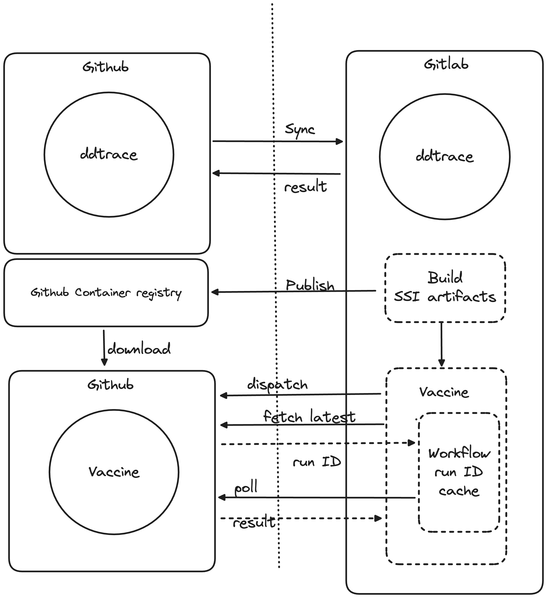

# Vaccine - A Testing Framework that simulates Datadog's Single Step Instrumention

This repository contains a GitHub Actions workflow designed to test Ruby applications across multiple Ruby versions and startup configurations. It uses Docker containers to create isolated testing environments and includes crash reporting capabilities.

## Overview

The workflow, named "Vaccine", automatically tests your Ruby application against multiple Ruby versions (from 1.8 to 3.4) with different startup commands. It uses Datadog's `catadog` mock server for trace collection and includes crash reporting functionality.

## Features

- Supports multiple Ruby versions (1.8 through 3.4)
- Tests various Rails startup commands
- Includes crash tracking and reporting
- Automated trace collection using Datadog's mock server
- Slack notifications for scheduled runs

## Workflow Triggers

The workflow runs on:
- Push events
- Daily schedule (7:00 UTC)
- Manual dispatch with optional commit SHA specification

<div align="center">
  
</div>

## Test Matrix

The workflow tests the following combinations:
- Ruby versions: 1.8, 1.9, 2.0-2.7, 3.0-3.4
- Startup commands:
  - `rails s`
  - `bin/rails s`
  - `bundle exec rails s`
  - `ruby hello.rb` (for older Ruby versions)

## Configuration
### Environment Variables

- `DD_TRACE_DEBUG`: Enabled for detailed tracing output
- `DD_INSTRUMENTATION_TELEMETRY_ENABLED`: Disabled in test environment to avoid noise.
- `DD_AGENT_HOST`: Set to localhost
- `DD_TRACE_AGENT_PORT`: Set to 8128
- `DD_CRASHTRACKING_ENABLED`: Enabled for crash reporting

### Validation

Crash report validation is enabled for Ruby versions:
- 2.7
- 3.0
- 3.1
- 3.2
- 3.3

## Usage

### Manual Trigger

You can manually trigger the workflow through GitHub Actions UI with these parameters:
- `commit_sha`: Specific commit to test (defaults to 'latest_snapshot')

### Local Development

To run the tests locally, ensure you have:
1. Docker installed
2. Ruby development environment
3. Access to GitHub container registry for `catadog` and `dd-lib-ruby-init`

## Directory Structure

```
.
├── .github/workflows/
│   └── vaccine.yml
├── src/
│   └── ruby/
│       └── [version]/
│           └── Dockerfile
└── records/
```

## Contributing

When contributing, ensure your changes:
1. Maintain compatibility across all supported Ruby versions
2. Include appropriate Dockerfile updates if needed
3. Update test cases as necessary
